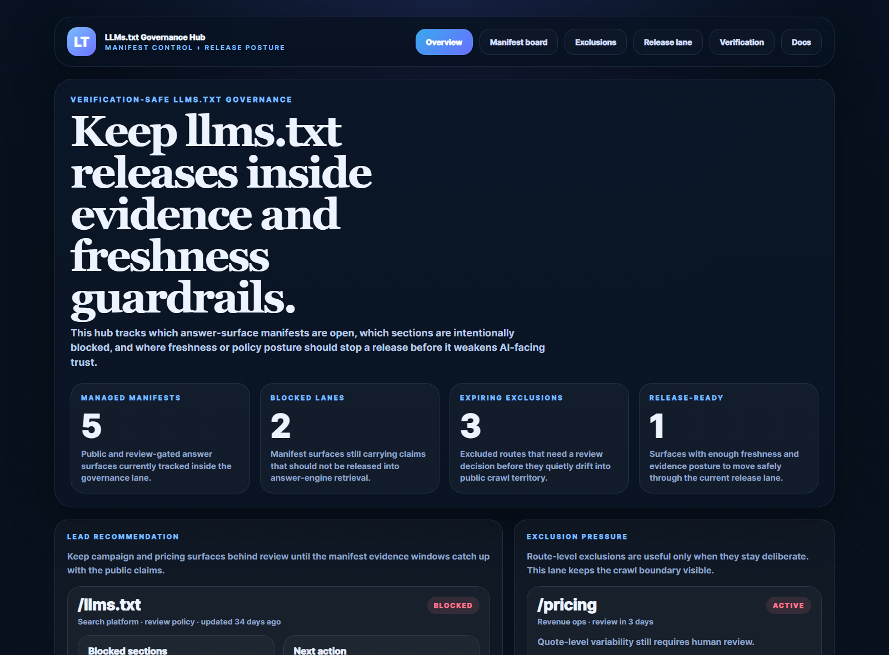
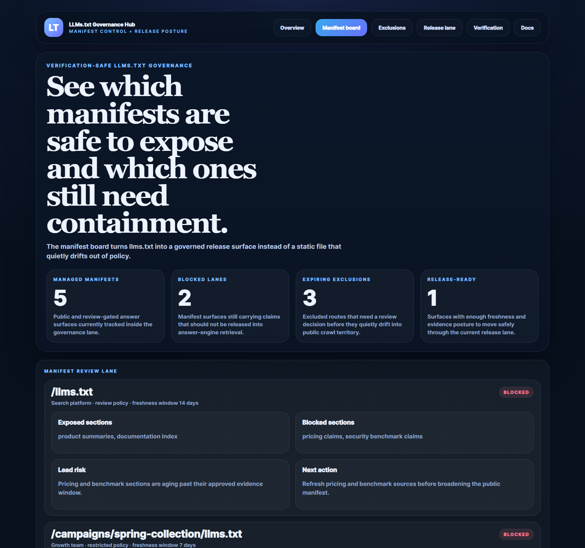
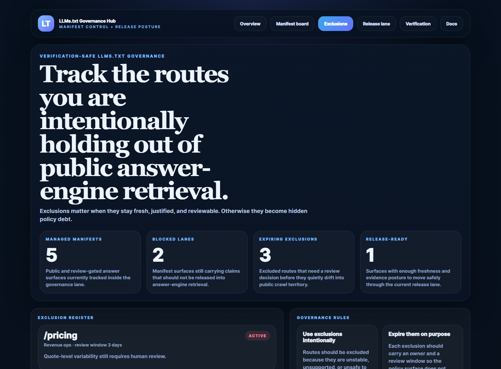
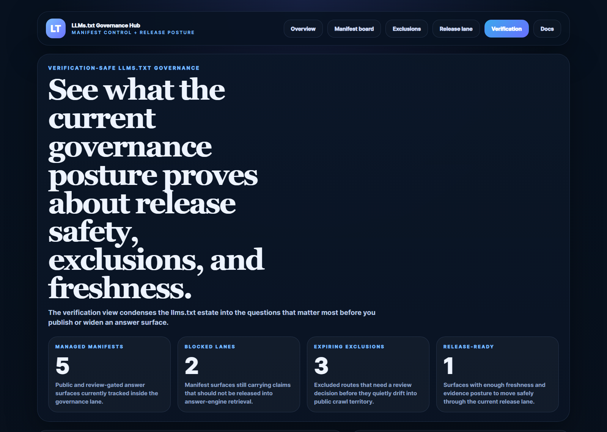

# LLMs.txt Governance Hub

LLMs.txt Governance Hub is a TypeScript control plane for managing `llms.txt` manifests, route exclusions, freshness windows, and answer-surface release posture.

It focuses on the release problem most teams ignore:
- which manifest sections should stay blocked
- which routes should remain excluded from public retrieval
- which surfaces are fresh enough to expose safely
- which changes need review before they widen AI-facing discovery

## Routes

- `/` overview dashboard
- `/manifest-board` manifest-by-manifest review lane
- `/exclusions` route exclusion register
- `/release-lane` release posture surface
- `/verification` current governance proof
- `/docs` route and payload reference

## What this repo proves

- `llms.txt` should be governed like a release surface, not edited like a static text file
- route exclusions only work when they stay owned, reviewed, and intentional
- freshness windows matter because AI-facing retrieval will happily amplify stale claims
- support-safe surfaces and volatile campaign surfaces should not share the same publication posture

## Screenshots






## Local development

```powershell
Set-Location "C:\Users\chaus\dev\repos\llms-txt-governance-hub"
npm install
npm run dev
```

## Validation

- `npm run build`
- `npm run test`
- `npm run demo`
- `npm run smoke`
- `npm run render:assets`
